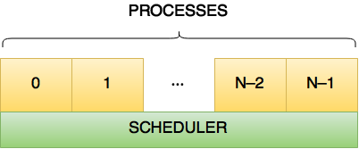
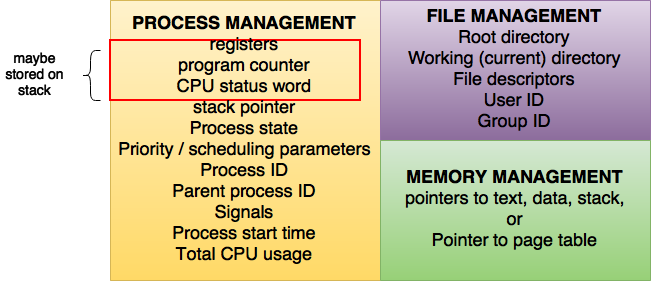

# ch02a
PROCESSES & THREADS I: PROCESSES & SCHEDULING

## PROCESSES & THREADS
- Process
	- --beforehand--: what do we need to know about process?
	- --where to find--: process tracking data structure
- Threads
- Scheduling
- Interprocess communication
- Classical IPC problems

## WHAT IS A PROCESS?
- Code, data, and stack
	- Usually (but not always) has its own address space
- Program state
	- CPU registers
	- Program counter (current location in the code)
	- Stack pointer
- Only one process can be running in the CPU at any given time!

## THE PROCESS MODEL

- Multiprogramming of four programs
- Conceptual model
	- 4 independent processes
	- Processes run sequentially
- Only one program active at any instant!
	- That instant can be very short…
	- Only applies if there’s a single CPU in the system

## WHEN IS A PROCESS CREATED?
- Processes can be created in two ways
	- System initialization: one or more processes created when the OS starts up
	- Execution of a process creation system call: something explicitly asks for a new process
- System calls can come from
	- User request to create a new process (system call executed from user shell)
	- Already running processes
		- User programs
		- System daemons

## WHEN DO PROCESSES END?
- Conditions that terminate processes can be
	- Voluntary
	- Involuntary
- Voluntary
	- Normal exit
	- Error exit
- Involuntary
	- Fatal error (only sort of involuntary)
	- Killed by another process

## PROCESS HIERARCHIES
- Parent creates a child process
	- Child processes can create their own children
- Forms a hierarchy
	- UNIX calls this a “process group”
	- If a process terminates, its children are “inherited” by the terminating process’s parent
- Windows has process groups
	- Multiple processes grouped together
	- One process is the “group leader”

## PROCESS STATES

- Process in one of 5 states
	- Created
	- Ready
	- Running
	- Blocked
	- Exit
- Transitions between states
	- Process enters ready queue
	- Scheduler picks this process
	- Scheduler picks a different process
	- Process waits for event (such as I/O)
	- Event occurs
	- Process exits
	- Process ended by another process

## PROCESSES IN THE OS

- Two “layers” for processes
- Lowest layer of process-structured OS handles interrupts, scheduling
- Above that layer are sequential processes
	- Processes tracked in the process table
	- Each process has a process table entry

## WHAT’S IN A PROCESS TABLE ENTRY?


## WHAT HAPPENS ON A TRAP / INTERRUPT?
1. Hardware saves program counter (on stack or in a special register)
2. Hardware loads new PC, identifies interrupt
3. Assembly language routine saves registers
4. Assembly language routine sets up stack
5. Assembly language calls C to run service routine
6. Service routine calls scheduler
7. Scheduler selects a process to run next (might be the one interrupted…)
8. Assembly language routine loads PC & registers for the selected process

## THREADS: “PROCESSES” SHARING MEMORY

- Process == address space
- Thread == program counter / stream of instructions
- Two examples
	- Three processes, each with one thread
	- One process with three threads

## PROCESS & THREAD INFORMATION


## THREADS & STACKS


## WHY USE THREADS?

- Allow a single application to do many things at once
	- Simpler programming model
	- Less waiting
- Threads are faster to create or destroy
	- No separate address space
- Overlap computation and I/O
	- Could be done without threads, but it’s harder
- Example: word processor
	- Thread to read from keyboard
	- Thread to format document
	- Thread to write to disk

## MULTITHREADED WEB SERVER


## 3 WAYS TO BUILD A SERVER
- Thread model
	- Parallelism
	- Blocking system calls
- Single-threaded process: slow, but easier to do
	- No parallelism
	- Blocking system calls
- Finite-state machine (event model)
	- Each activity has its own state
	- States change when system calls complete or interrupts occur
	- Parallelism
	- Nonblocking system calls
	- Interrupts

## IMPLEMENTING THREADS

- User-level threads
	- [+] No need for kernel support
	- [–] May be slower than kernel threads
	- [–] Harder to do non-blocking I/O
- Kernel-level threads
	- [+] More flexible scheduling
	- [+] Non-blocking I/O
	- [–] Not portable

## SCHEDULING
- What is scheduling?
	- Goals
	- Mechanisms
- Scheduling on batch systems
- Scheduling on interactive systems
- Other kinds of scheduling
	- Real-time scheduling

## WHY SCHEDULE PROCESSES?

- Bursts of CPU usage alternate with periods of I/O wait
- Some processes are CPU-bound: they don’t many I/O requests
	- Other processes are I/O-bound and make many kernel requests

## WHEN ARE PROCESSES SCHEDULED?
- At the time they enter the system
	- Common in batch systems
	- Two types of batch scheduling
		- Submission of a new job causes the scheduler to run
		- Scheduling only done when a job voluntarily gives up the CPU (i.e., while waiting for an I/O request)
- At relatively fixed intervals (clock interrupts)
	- Necessary for interactive systems
	- May also be used for batch systems
	- Scheduling algorithms at each interrupt, and picks the next process from the pool of “ready” processes

## SCHEDULING GOALS
- #### All systems
	- Fairness: give each process a fair share of the CPU
	- Enforcement: ensure that the stated policy is carried out
	- Balance: keep all parts of the system busy
- #### Batch systems
	- Throughput: maximize jobs per unit time (hour)
	- Turnaround time: minimize time users wait for jobs
	- CPU utilization: keep the CPU as busy as possible
- #### Interactive systems
	- Response time: respond quickly to users’ requests
	- Proportionality: meet users’ expectations
- #### Real-time systems
	- Meet deadlines: missing deadlines is a system failure!
	- Predictability: same type of behavior for each time slice

## MEASURING SCHEDULING PERFORMANCE
- #### Throughput
	- Amount of work completed per second (minute, hour)
	- Higher throughput usually means better utilized system
- #### Response time
	- Response time is time from when a command is submitted until results are returned
	- Can measure average, variance, minimum, maximum, ...
	- May be more useful to measure time spent waiting
- #### Turnaround time
	- Like response time, but for batch jobs (response is the completion of the process)
- Usually not possible to optimize for **all** metrics with a single scheduling algorithm

## INTERACTIVE vs. BATCH SCHEDULING
| batch | interactive |
| :---: | :---------: |
| First-Come-First-Served (FCFS) | Round-Robin (RR) |
| Shortest Job First (SJF) | Priority (preemptive) |
| Shortest Remaining Time First (SRTF) | Multi-level feedback queue |
| Priority (non-preemptive) | Lottery scheduling |

## FIRST COME, FIRST SERVED (FCFS)

- Goal: do jobs in the order they arrive
	- Fair in the same way a bank teller line is fair
- Simple algorithm!
- Problem: long jobs delay every job after them
	- Many processes may wait for a single long job
	- wait-time: $$\tfrac{1}{4}\left(0+(4)+(4+3)+(4+3+6)\right)$$

## SHORTEST JOB FIRST (SJF)

- **Goal**: do the shortest job first
	- Short jobs complete first
	- Long jobs delay every job after them
- Jobs sorted in increasing order of execution time
	- Ordering of ties doesn’t matter
- **Shortest Remaining Time First (SRTF)**: preemptive form of SJF
	- Re-evaluate when a new job is submitted
	- wait-time: $$\tfrac{1}{4} \left((0)+(3)+(3+3)+(3+3+4)\right)$$
	- throughput is SAME
- **Problem**: how does the scheduler know how long a job will take?

## THREE-LEVEL SCHEDULING

- Jobs held in input queue until moved into memory
	- Pick “complementary jobs”: small & large, CPU- & I/O-intensive
	- Jobs move into memory when admitted
- CPU scheduler picks next job to run
- Memory scheduler picks some jobs from main memory and moves them to disk if insufficient memory space

## ROUNR ROBIN (RR) SCHEDULING

- Round Robin scheduling
	- Give each process a fixed time slot (quantum)
	- Rotate through “ready” processes
	- Each process makes some progress
- What’s a good quantum?
	- **Too short**: many process switches hurt efficiency
	- **Too long**: poor response to interactive requests
	- **Typical length**: $$10$$–$$100\:\text{ms}$$

## PRIORITY SCHEDULING

-  Assign a priority to each process
	- “Ready” process with highest priority allowed to run
	- Running process may be interrupted after its quantum expires
- Priorities may be assigned dynamically
	- Reduced when a process uses CPU time
	- Increased when a process waits for I/O
- Often, processes grouped into multiple queues based on priority, and run round-robin per queue

## SHORTEST PROCESS NEXT
- Run the process that will finish the soonest
	- In interactive systems, job completion time is unknown!
- Guess at completion time based on previous runs
	- Update estimate each time the job is run
	- Estimate is a combination of previous estimate and most recent run time
- Not often used because round robin with priority works so well!

## LOTTERY SCHEDULING
- Give processes “tickets” for CPU time
	- More tickets => higher share of CPU
- Each quantum, pick a ticket at random
	- If there are n tickets, pick a number from $$1$$ to $$n$$
	- Process holding the ticket gets to run for a quantum
- Over the long run, each process gets the CPU $$m/n$$ of the time if the process has $$m$$ of the $$n$$ existing tickets.
- Tickets can be transferred
	- Cooperating processes can exchange tickets
	- Clients can transfer tickets to server so it can have a higher priority

## POLICY vs. MECHANISM
-  Separate what may be done from how it is done
	- Mechanism allows
		- Priorities to be assigned to processes
		- CPU to select processes with high priorities
	- Policy set by what priorities are assigned to processes
- Scheduling algorithm parameterized
	- Mechanism in the kernel
	- Priorities assigned in the kernel or by users
- Parameters may be set by user processes
	- Don’t allow a user process to take over the system!
	- Allow a user process to voluntarily lower its own priority
	- Allow a user process to assign priority to its threads

## SCHEDULING USER-LEVEL THREADS

- Kernel picks a process to run next
- Run-time system (at user level) schedules threads
	- Run each thread for less than process quantum
	- Example: processes get 40ms each, threads get 10ms each
- Example schedule:
$$
A1,\:A2,\:A3,\:A1,\:B1,\:B3,\:B2,\:B3
$$
- Not possible:
$$
A1,\:A2,\:B1,\:B2,\:A3,\:B3,\:A2,\:B1
$$

## SCHEDULING KERNAL-LEVEL THREADS

- Kernel schedules each thread
	- No restrictions on ordering
	- May be more difficult for each process to specify priorities
- Example schedule:
$$
A1,\:A2,\:A3,\:A1,\:B1,\:B3,\:B2,\:B3
$$
- Also possible:
$$
A1,\:A2,\:B1,\:B2,\:A3,\:B3,\:A2,\:B1
$$
