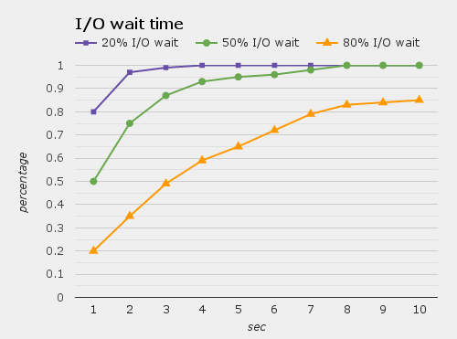

# ch04a
MEMORY MANAGEMENT I: An OS Perspective

## MEMORY MANAGEMENT
- Basic memory management
- Swapping
- Virtual memory
- Page replacement algorithms
- Modeling page replacement algorithms
- Design issues for paging systems
- Implementation issues
- Segmentation

## IN AN IDEAL WORLD
- The ideal world has memory that is
    - Very large
    - Very fast
    - Non-volatile (doesn’t go away when power is turned off)
- The real world has memory that is:
    - Very large
    - Very fast
    - Affordable!
        - Pick any two...
- Memory management goal: make the real world look as much like the ideal world as possible

## MEMORY HIERARCHY
- What is the memory hierarchy?
    - Different levels of memory
    - Some are small & fast
    - Others are large & slow
- What levels are usually included?
    - Cache: small amount of fast, expensive memory
        - L1 (level 1) cache: usually on the CPU chip
        - L2: may be on or off chip
        - L3 cache: off-chip, made of SRAM
    - Main memory: medium-speed, medium price memory (DRAM)
    - Disk: many gigabytes of slow, cheap, non-volatile storage
- Memory manager handles the memory hierarchy

## BASIC MEMORY MANAGEMENT

- Components include
    - Operating system (perhaps with device drivers)
    - Single process
- Goal: lay these out in memory
    - Memory protection may not be an issue (only one program)
    - Flexibility may still be useful (allow OS changes, etc.)
- No swapping or paging


## FIXED PARTITIONS: MULTIPLE PROGRAMS

- Fixed memory partitions
    - Divide memory into fixed spaces
    - Assign a process to a space when it’s free
- Mechanisms
    - Separate input queues for each partition
    - Single input queue: better ability to optimize CPU usage

## HOW MANY PROCESSES ARE ENOUGH?
- Several memory partitions (fixed or variable size)
- Lots of processes wanting to use the CPU
- Tradeoff
    - More processes utilize the CPU better
    - Fewer processes use less memory (cheaper!)
- How many processes do we need to keep the CPU fully utilized?
    - This will help determine how much memory we need
    - Is this still relevant with memory costing $150/GB?

## MODELING MULTIPROGRAMMING
- More I/O wait means less processor utilization
    - At 20% I/O wait, 3–4 processes fully utilize CPU
    - At 80% I/O wait, even 10 processes aren’t enough
- This means that the OS should have more processes if they’re I/O bound
- More processes ⇒ memory management & protection more important!

NOT GOOD: one process is running CPU all to itself. Individual jobs are getting slower as the number of jobs increases

## MULTIPROGRAMMING SYSTEM PERFORMANCE

- Arrival and work requirements of 4 jobs
- CPU utilization for 1–4 jobs with 80% I/O wait
- Sequence of events as jobs arrive and finish
    - Numbers show amount of CPU time jobs get in each interval
    - More processes ⇒ better utilization, less time per process

## MEMORY AND MULTIPROGRAMMING
- Memory needs two things for multiprogramming
    - Relocation
    - Protection
- The OS cannot be certain where a program will be loaded in memory
    - Variables and procedures can’t use absolute locations in memory
    - Several ways to guarantee this
- The OS must keep processes’ memory separate
    - Protect a process from other processes reading or modifying its own memory
    - Protect a process from modifying its own memory in undesirable ways (such as writing to program code)

## BASE AND LIMIT REGISTERS

- Special CPU registers: base & limit
    - Access to the registers limited to system mode
    - Registers contain
        - Base: start of the process’s memory partition
        - Limit: length of the process’s memory partition
- Address generation
    - Physical address: location in actual memory
    - Logical address: location from the process’s point of view
    - Physical address = base + logical address
    - Logical address larger than limit ⇒ error

## SWAPPING

- Memory allocation changes as
    - Processes come into memory
    - Processes leave memory
        - Swapped to disk
        - Complete execution
- Gray regions are unused memory

## SWAPPING: LEAVING ROOM TO GROW

- Need to allow for programs to grow
    - Allocate more memory for Process data B
    - Larger stack
- Handled by allocating more space than is necessary at the start
    - Inefficient: wastes memory that’s not currently in use
    - What if the process requests too much memory?

## TRACKING MEMORY USAGE:  BITMAPS

- Keep track of free / allocated memory regions with a bitmap
    - One bit in map corresponds to a fixed-size region of memory
    - Bitmap is a constant size for a given amount of memory regardless of how much is allocated at a particular time
- Chunk size determines efficiency
    - At 1 bit per 4KB chunk, we need just 256 bits (32 bytes) per MB of memory
    - For smaller chunks, we need more memory for the bitmap
    - Can be difficult to find large contiguous free areas in bitmap

## TRACKING MEMORY USAGE:  LINKED LISTS

- Keep track of free / allocated memory regions with a linked list
    - Each entry in the list corresponds to a contiguous region of memory
    - Entry can indicate either allocated or free (and, optionally, owning process)
    - May have separate lists for free and allocated areas
- Efficient if chunks are large
    - Fixed-size representation for each region
    - More regions ⇒ more space needed for free lists

## ALLOCATING MEMORY

- Search through region list to find a large enough space
- Suppose there are several choices: which one to use?
    - First fit: the first suitable hole on the list
    - Next fit: the first suitable after the previously allocated hole
    - Best fit: the smallest hole that is larger than the desired region (wastes least space?)
    - Worst fit: the largest available hole (leaves largest fragment)
- Option: maintain separate queues for different-size holes

## FREEING MEMOERY

- Allocation structures must be updated when memory is freed
- Easy with bitmaps: just set the appropriate bits in the bitmap
- Linked lists: modify adjacent elements as needed
    - Merge adjacent free regions into a single region
    - May involve merging two regions with the just-freed area

## LIMITATIONS OF SWAPPING
- Problems with swapping
    - Process must fit into physical memory (impossible to run larger processes)
    - Memory becomes fragmented
        - External fragmentation: lots of small free areas
        - Compaction needed to reassemble larger free areas
    - Processes are either in memory or on disk: half and half doesn’t do any good
- Overlays solved the first problem
    - Bring in pieces of the process over time (typically data)
    - Still doesn’t solve the problem of fragmentation or partially resident processes

## VIRTUAL MEMORY
- Basic idea: allow the OS to hand out more memory than exists on the system
- Keep recently used stuff in physical memory
- Move less recently used stuff to disk
- Keep all of this hidden from processes
    - Processes still see an address space from 0–max address
    - Movement of information to and from disk handled by the OS without process help
- Virtual memory (VM) especially helpful in multiprogrammed systems
    - CPU schedules process B while process A waits for its memory to be retrieved from disk

## VIRTUAL AND PHYSICAL ADDRESSES

- Program uses virtual addresses
    -  Addresses local to the process
    - Hardware translates virtual address to physical address
- Translation done by the Memory Management Unit
    - Usually on the same chip as the CPU
    - Only physical addresses leave the CPU/MMU chip
- Physical memory indexed by physical addresses

## PAGING AND PAGE TABLES

- Virtual addresses mapped to physical addresses
    - Unit of mapping is called a page
    - All addresses in the same virtual page are in the same physical page
    - Page table entry {PTE} contains translation for a single page
- Table translates virtual page number
    - Not all virtual memory has a physical page
    - Not every physical page need be used
- Example:
    - 64 KB virtual memory
    - 16 KB physical memory

## WHAT’S IN A {PTE}?

- Each entry in the page table contains
    - Valid bit: set if this logical page number has a corresponding physical frame in memory
        - If not valid, remainder of PTE is irrelevant
    - Page frame number: page in physical memory
    - Referenced bit: set if data on the page has been accessed
    - Dirty (modified) bit: set if data on the page has been modified
    - Protection information

## MAPPING LOGICAL TO PHYSICAL ADDRESS

- Split address from CPU into two pieces
    - Page number (p)
    - Page offset (d)
- Page number
    - Index into page table
    - Page table contains base address of page in physical memory
- Page offset
    - Added to base address to get actual physical memory address
- Page size = 2d bytes
- EXAMPLE
    - 4 KB (=4096 byte) pages
    - 32 bit logical addresses

## ADDRESS TRANSLATION ARCHITECTURE

## MEMORY & PAGING STRUCTURES


## TWO-LEVEL PAGE TABLES

- Problem: page tables can be too large
    - 232 bytes in 4KB pages ⇒ 1 million PTEs
- Solution: use multi-level page tables
    - “Page size” in first page table is large (megabytes)
    - PTE marked invalid in first page table needs no 2nd level page table
- 1st level page table has pointers to 2nd level page tables
- 2nd level page table has actual physical page numbers in it

## MORE ON TWO-LEVEL PAGE TABLES
- Tradeoffs between 1st and 2nd level page table sizes
    - Total number of bits indexing 1st and 2nd level table is constant for a given page size and logical address length
    - Tradeoff between number of bits indexing 1st and number indexing 2nd level tables
        - More bits in 1st level: fine granularity at 2nd level
        - Fewer bits in 1st level: maybe less wasted space?
- All addresses in table are physical addresses
- Protection bits kept in 2nd level table

## TWO-LEVEL PAGING: EXAMPLE

- System characteristics
    - 8 KB pages
    - 32-bit logical address divided into 13 bit page offset, 19 bit page number
- Page number divided into:
    - 10 bit page number
    - 9 bit page offset
- Logical address looks like this:
    - p1 is an index into the 1st level page table
    - p2 is an index into the 2nd level page table pointed to by p1

## TWO-LEVEL ADDRESS TRANSLATION: EXAMPLE


## IMPLEMENTING PAGE TABLES IN HARDWARE
- Page table resides in main (physical) memory
- CPU uses special registers for paging
    - Page table base register (PTBR) points to the page table
    - Page table length register (PTLR) contains length of page table: restricts maximum legal logical address
- Translating an address requires two memory accesses
    - First access reads page table entry (PTE)
    - Second access reads the data / instruction from memory
- Reduce number of memory accesses
    - Can’t avoid second access (we need the value from memory)
    - Eliminate first access by keeping a hardware cache (called a translation lookaside buffer or TLB) of recently used page table entries

## TRANSLATION LOOKASIDE BUFFER {TLB}

- Search the {TLB} for the desired logical page number
    - Search entries in parallel
    - Use standard cache techniques
- If desired logical page number is found, get frame number from TLB
- If desired logical page number isn’t found
    - Get frame number from page table in memory
    - Replace an entry in the TLB with the logical & physical page numbers from this reference

## HANDLING {TLB} MISSES
- If PTE isn’t found in TLB, OS needs to do the lookup in the page table
- Lookup can be done in hardware or software
- Hardware TLB replacement
    - CPU hardware does page table lookup
    - Can be faster than software
    - Less flexible than software, and more complex hardware
- Software TLB replacement
    - OS gets TLB exception
    - Exception handler does page table lookup & places the result into the TLB
    - Program continues after return from exception
    - Larger TLB (lower miss rate) can make this feasible

## HOW LONG DO MEMORY ACCESSES TAKE?
- Assume the following times:
    - TLB lookup time = a (often zero—overlapped in CPU)
    - Memory access time = m
- Hit ratio (h) is percentage of time that a logical page number is found in the TLB
    - Larger TLB usually means higher h
    - TLB structure can affect h as well
- Effective access time (an average) is calculated as:
    - EAT = (m + a)h + (m + m + a)(1 – h)
    - EAT = a + (2 – h)m
- Interpretation
    - Reference always requires TLB lookup, 1 memory access
    - TLB misses also require an additional memory reference

## INVERTED PAGE TABLE
- Reduce page table size further: keep one entry for each frame in memory
    - Alternative: merge tables for pages in memory and on disk
- PTE contains
    - Virtual address pointing to this frame
    - Information about the process that owns this page
- Search page table by
    - Hashing the virtual page number and process ID
    - Starting at the entry corresponding to the hash result
    - Search until either the entry is found or a limit is reached
- Page frame number is index of PTE
- Improve performance by using more advanced hashing algorithms

## INVERTED PAGE TABLE ARCHITECTURE

