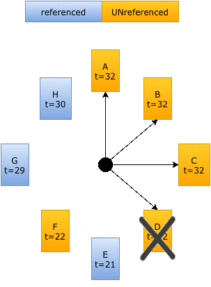
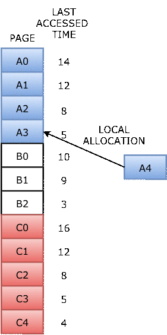

# ch04b
MEMORY MANAGEMENT II:  
Paging Algorithms and Implementation Issues

## PAGE REPLACEMENT ALGORITHMS
- Page fault forces a choice
    - No room for new page (steady state)
    - Which page must be removed to make room for an incoming page?
- How is a page removed from physical memory?
    - If the page is unmodified, simply overwrite it: a copy already exists on disk
    - If the page has been modified, it must be written back to disk: prefer unmodified pages?
- Better not to choose an often used page
    - It’ll probably need to be brought back in soon.

//more page faults => BAD

## OPTIMAL PAGE REPLACEMENT ALGORITHM 
- What’s the best we can possibly do?
    - Assume perfect knowledge of the future
    - Not realizable in practice (usually)
    - Useful for comparison: if another algorithm is within 5% of optimal, not much more can be done...
- Algorithm: replace the page that will be used furthest in the future
    - Only works if we know the whole sequence!
    - Can be approximated by running the program twice
        - Once to generate the reference trace
        - Once (or more) to apply the optimal algorithm
- Nice, but not achievable in real systems!

## NOT-RECENTLY-USED {NRU} ALGORITHM
- Each page has reference bit and dirty bit
    - Bits are set when page is referenced and/or modified 
- Pages are classified into four classes
    - 0: not referenced, not dirty
    - 1: not referenced, dirty
    - 2: referenced, not dirty
    - 3: referenced, dirty
- Clear reference bit for all pages periodically
    - Can’t clear dirty bit: needed to indicate which pages need to be flushed to disk
    - Class 1 contains dirty pages where reference bit has been cleared
- Algorithm: remove a page from the lowest non-empty class
    - Select a page at random from that class
- Easy to understand and implement 
- Performance adequate (though not optimal)

## FIRST-IN, FIRST-OUT {FIFO} ALGORITHM
- Maintain a linked list of all pages
    - Maintain the order in which they entered memory
- Page at front of list replaced
- Advantage: (really) easy to implement
- Disadvantage: page in memory the longest may be often used
    - This algorithm forces pages out regardless of usage
    - Usage may be helpful in determining which pages to keep

## SECOND CHANCE PAGE REPLACEMENT

- Modify FIFO to avoid throwing out heavily used pages 
    - If reference bit is 0, throw the page out
    - If reference bit is 1
        - Reset the reference bit to 0
        - Move page to the tail of the list - Continue search for a free page
- Still easy to implement, and better than plain FIFO

## CLOCK ALGORITHM

- Same functionality as second chance
- Simpler implementation
    - “Clock” hand points to next page to replace
    - If R=0, replace page
    - If R=1, set R=0 and advance the clock hand
- Continue until page with R=0 is found
    - This may involve going all the way around the clock...

## LEAST-RECENTLY-USED {LRU}
- Assume pages used recently will used again soon 
    - Throw out page that has been unused for longest time
- Must keep a linked list of pages
    - Most recently used at front, least at rear 
    - Update this list every memory reference!
        - This can be somewhat slow: hardware has to update a linked list on every reference!
- Alternatively, keep counter in each page table entry
    - Global counter increments with each CPU cycle
    - Copy global counter to PTE counter on a reference to the page 
    - For replacement, evict page with lowest counter value

## SIMULATING {LRU} IN SOFTWARE
- Few computers have the necessary hardware to implement full LRU
    - Linked-list method impractical in hardware
    - Counter-based method could be done, but it’s slow to find the desired page
- Approximate LRU with Not Frequently Used {NFU} algorithm
    - At each clock interrupt, scan through page table
    - If R=1 for a page, add one to its counter value
    - On replacement, pick the page with the lowest counter value
- Problem: no notion of age—pages with high counter values will tend to keep them!

## AGING REPLACEMENT ALGORITHM

- Reduce counter values over time
    - Divide by two every clock cycle (use right shift) 
    - More weight given to more recent references!
- Select page to be evicted by finding the lowest counter value Algorithm is:
    - Every clock tick, shift all counters right by 1 bit
    - On reference, set leftmost bit of a counter (can be done by copying the reference bit to the counter at the clock tick)

## WORKING SET
- Demand paging: bring a page into memory when it’s requested by the process
- How many pages are needed?
    - Could be all of them, but not likely
    - Instead, processes reference a small set of pages at any given time—locality of reference
    - Set of pages can be different for different processes or even different times in the running of a single process
- Set of pages used by a process in a given interval of time is called the working set
    - If entire working set is in memory, no page faults!
    - If insufficient space for working set, thrashing may occur
    - Goal: keep most of working set in memory to minimize the number of page faults suffered by a process

## HOW BIG IS THE WORKING SET?

- Working set is the set of pages used by the k (steps) most recent memory references
    - w(k ,t) is the size of the working set at time t
    - Size of working set can change over time as well...

## WORKING SET PAGE REPLACEMENT ALGORITHM


## PAGE REPLACEMENT ALGORITHMS: SUMMARY

| Algorithm | Comment | 
| :-------: | :------ |
| OPT (optional) | Not implementable, but useful as a benchmark |
| NRU (Not Recently Used) | Crude |
| FIFO (First-In, First-Out) | Might throw out useful pages | 
| Second Chance | Big improvement over FIFO | 
| Clock | Better implementation of Second Chance | 
| LRU (Least Recently Used) | Excellent, but hard to implement exactly | 
| NFU (Not Frequently Used) | Poor approximation to LRU | 
| Aging | Good approximation to LRU, efficient to implement |
| Working Set | Somewhat expensive to implement | 
| WSClock | Implementable version of Working Set | 

## MODELING PAGE REPLACEMENT ALGORITHMS
- Goal: provide quantitative analysis (or simulation) showing which algorithms do better
    - Workload (page reference string) is important: different strings may favor different algorithms
    - Show tradeoffs between algorithms
- Compare algorithms to one another
- Model parameters within an algorithm
    - Number of available physical pages
    - Number of bits for aging

## HOW IS MODELING DONE?

- Generate a list of references
    - Artificial (made up)
    - Trace a real workload (set of processes)
- Use an array (or other structure) to track the pages in physical memory at any given time
    - May keep other information per page to help simulate the algorithm (modification time, time when paged in, etc.)
- Run through references, applying the replacement algorithm 
- Example: FIFO replacement on reference string 0 1 2 3 0 1 4 0 1 2 3 4 
    - Page replacements highlighted in yellow

## BELADY’S ANOMALY

- Reduce the number of page faults by supplying more memory
    - Use previous reference string and {FIFO} algorithm
    - Add another page to physical memory (total 4 pages)
- More page faults (10 vs. 9), not fewer!?!
    - This is called Belady’s anomaly
    - Adding more pages shouldn’t result in worse performance!
- Motivated the study of paging algorithms

## MODELING MORE REPLACEMENT ALGORITHMS
- Paging system characterized by:
    - Reference string of executing process
    - Page replacement algorithm
    - Number of page frames available in physical memory (m)
- Model this by keeping track of all n pages referenced in array M
    - Top part of M has m pages in memory
    - Bottom part of M has n-m pages stored on disk
- Page replacement occurs when page moves from top to bottom
    - Top and bottom parts may be rearranged without causing movement between memory and disk

## EXAMPLE: {LRU}

- Model {LRU} replacement with
    - 8 unique references in the reference string
    - 4 pages of physical memory
- Array state over time shown below
- {LRU} treats list of pages like a stack

## STACK ALGORITHMS
- {LRU} is an example of a stack algorithm
- For stack algorithms
    - Any page in memory with m physical pages is also in memory with m+1 physical pages
    - Increasing memory size is guaranteed to reduce (or at least not increase) the number of page faults
- Stack algorithms do not suffer from Belady’s anomaly
- Distance of a reference == position of the page in the stack before the reference was made
    - Distance is ∞ if no reference had been made before
    - Distance depends on reference string and paging algorithm: might be different for LRU and optimal (both stack algorithms)

## PREDICTING PAGE FAULT RATES USING DISTANCE
- Distance can be used to predict page fault rates
- Make a single pass over the reference string to generate the distance string on-the-fly
- Keep an array of counts
    - Entry j counts the number of times distance j occurs in the distance string
- The number of page faults for a memory of size m is the sum of the counts for j > m
    - This can be done in a single pass!
    - Makes for fast simulations of page replacement algorithms
- This is why virtual memory theorists like stack algorithms!

## LOCAL VS. GLOBAL ALLOCATION POLICIES

- What is the pool of pages eligible to be replaced?
    - Pages belonging to the process needing a new page
    - All pages in the system
- Local allocation: replace a page from this process
    - May be more “fair”: penalize processes that replace many pages
    - Can lead to poor performance: some processes need more pages than others
- Global allocation: replace a page from any process

## PAGE FAULT RATE VS. ALLOCATED FRAMES 

- Local allocation may be more “fair”
    - Don’t penalize other processes for high page fault rate
- Global allocation is better for overall system performance
    - Take page frames from processes that don’t need them as much
    - Reduce the overall page fault rate (even though rate for a single process may go up)

## CONTROL OVERALL PAGE FAULT RATE
- Despite good designs, system may still thrash
- Most (or all) processes have high page fault rate
    - Some processes need more memory, ...
    - but no processes need less memory (and could give some up)
- Problem: no way to reduce page fault rate
- Solution: Reduce number of processes competing for memory 
    - Swap one or more to disk, divide up pages they held
    - Reconsider degree of multiprogramming

## HOW BIG SHOULD A PAGE BE?
- Smaller pages have advantages
    - Less internal fragmentation
    - Better fit for various data structures, code sections
    - Less unused physical memory (some pages have 20 useful bytes and the rest isn’t needed currently)
- Larger pages are better because
    - Less overhead to keep track of them
        - Smaller page tables
        - TLB can point to more memory (same number of pages, but more memory per page)
        - Faster paging algorithms (fewer table entries to look through)
    - More efficient to transfer larger pages to and from disk

## SEPARATE I & D ADDRESS SPACES

- One user address space for both data & code
    - Simpler
    - Code/data separation harder to enforce
    - More address space?
- One address space for data, another for code
    - Code & data separated
    - More complex in hardware
    - Less flexible
    - CPU must handle instructions & data differently 
- MINIX does the latter

## SHARING PAGES
- Processes can share pages
    - Entries in page tables point to the same physical page frame
    - Easier to do with code: no problems with modification
- Virtual addresses in different processes can be... 
    - The same: easier to exchange pointers, keep data structures consistent
    - Different: may be easier to actually implement
        - Not a problem if there are only a few shared regions 
        - Can be very difficult if many processes share regions with each other

## WHEN ARE DIRTY PAGES WRITTEN TO DISK?
- On demand (when they’re replaced)
    - Fewest writes to disk
    - Slower: replacement takes twice as long (must wait for disk write and disk read)
- Periodically (in the background)
    - Background process scans through page tables, writes out dirty pages that are pretty old
- Background process also keeps a list of pages ready for replacement
    - Page faults handled faster: no need to find space on demand 
    - Cleaner may use the same structures discussed earlier (clock, etc.)

## IMPLEMENTATION ISSUES
- Four times when OS involved with paging
- Process creation
    - Determine program size 
    - Create page table
- During process execution
    - Reset the MMU for new process
    - Flush the TLB (or reload it from saved state)
- Page fault time
    - Determine virtual address causing fault 
    - Swap target page out, needed page in
- Process termination time
    - Release page table
    - Return pages to the free pool

## HOW IS A PAGE FAULT HANDLED?
1. Hardware causes a page fault
2. General registers saved (as on every exception)
3. OS determines which virtual page needed 
    1. Actual fault address in a special register
    2. Address of faulting instruction in register
        1. Page fault was in fetching instruction, or
        2. Page fault was in fetching operands for instruction 
        3. OS must figure out which...
4. OS checks validity of address
5. Process killed if address was illegal
6. OS finds a place to put new page frame
7. If frame selected for replacement is dirty, write it out to disk OS requests the new page from disk
8. Page tables updated
9. Faulting instruction backed up so it can be restarted
10. Faulting process scheduled
11. Registers restored
12. Program continues

## BACKING UP AN INSTRUCTION
- Problem: page fault happens in the middle of instruction execution
    - Some changes may have already happened 
    - Others may be waiting for VM to be fixed
- Solution: undo all of the changes made by the instruction 
    - Restart instruction from the beginning
    - This is easier on some architectures than others
- Example: LW R1, 12(R2)
    - Page fault in fetching instruction: nothing to undo
    - Page fault in getting value at 12(R2): restart instruction
- Example: ADD (Rd)+, (Rs1)+, (Rs2)+
    - Page fault in writing to (Rd): may have to undo an awful lot...

## LOCKING PAGES IN MEMORY
- Virtual memory and I/O occasionally interact
- P1 issues call for read from device into buffer 
    - While it’s waiting for I/O, P2 runs
    - P2 has a page fault
    - P1’s I/O buffer might be chosen to be paged out
        - This can create a problem because an I/O device is going to write to the buffer on P1’s behalf
- Solution: allow some pages to be locked into memory 
    - Locked pages are immune from being replaced
    - Pages only stay locked for (relatively) short periods

## STORING PAGES ON DISK

- Pages removed from memory are stored on disk
- Where are they placed?
    - Static swap area: easier to code, less flexible
    - Dynamically allocated space: more flexible, harder to locate a page
        - Dynamic placement often uses a special file (managed by the file system) to hold pages
- Need to keep track of which pages are where within the on-disk storage

## SEPARATING POLICY AND MECHANISM

- Mechanism for page replacement has to be in kernel 
    - Modifying page tables
    - Reading and writing page table entries
- Policy for deciding which pages to replace could be in user space
    - More flexibility

## WHY USE SEGMENTATION?

- Different “units” in a single virtual address space
    - Each unit can grow
    - How can they be kept apart? 
    - Example: symbol table is out of space
- Solution: segmentation 
    - Give each unit its own
 

## USING SEGMENTS

- Each region of the process has its own segment 
- Each segment can start at 0
    - Addresses within the segment relative to the segment start 
- Virtual addresses are <segment #, offset within segment>

## PAGING VS. SEGMENTATION

| What? | paging | Segmentation |
| :---- | :----: | :----------: |
| need the programmer know about it? | no | yes |
| how many linear address spaces?| 1 | many |
| more addresses than physical memory? | yes | yes |
| separate protection for different objects? | not really | yes |
| variable-sized objects handled with ease? | no | yes | 
| is sharing easy? | no | yes | 
| why use it? | more addresss spacewithout buying more memory | break program into logical places that are handled separately. |

## IMPLEMENTING SEGMENTATION


## A BETTER WAY: SEGMENTATION WITH PAGING


## TRANSLATING AN ADDRESS IN “MULTICS”


## MEMORY MANAGEMENT IN THE PENTIUM


## CONVERTING SEGMENT TO LINEAR ADDRESS

- Selector identifies segment descriptor
    - Limited number of selectors available in the CPU 
- Offset added to segment’s base address 
- Result is a virtual address that will be translated by paging 


## TRANSLATING VIRTUAL TO PHYSICAL ADDRESSES

- Pentium uses two-level page tables
    - Top level is called a “page directory” (1024 entries) 
    - Second level is called a “page table” (1024 entries each) • 4 KB pages 
